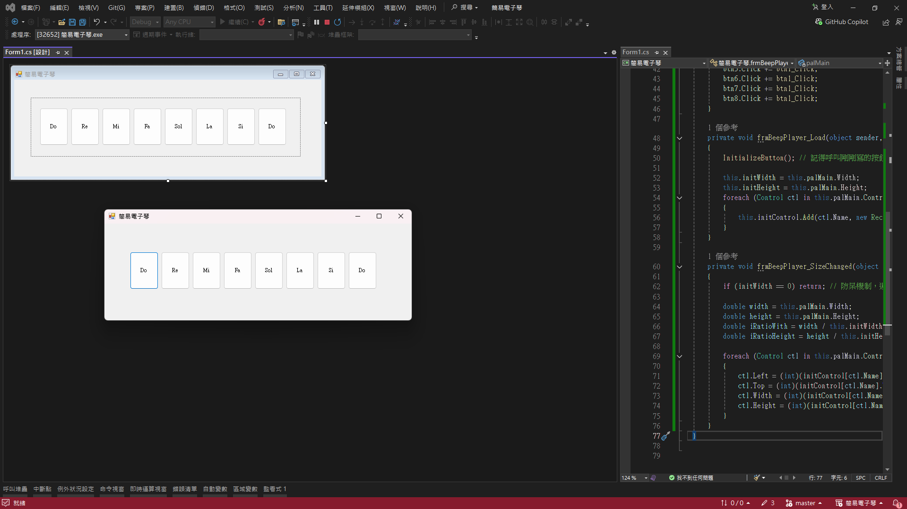

# 簡易電子琴 (Simple Electronic Piano)

## 專案簡介
本專案為視窗程式設計 (II) 的上課練習，使用 C# WinForms 與 Windows 系統 API (`kernel32.dll` 的 `Beep` 函式) 實作一個簡易的電子琴應用程式。

## 系統需求
- 開發環境：Visual Studio (Windows Forms .NET Framework)
- 系統限制：需在 Windows 作業系統環境下執行（依賴作業系統底層 API 發聲）

## 功能說明
- **音符彈奏**：介面上提供 Do、Re、Mi、Fa、Sol、La、Si、Do 共八個實體按鍵。
- **系統發聲**：透過呼叫 Win API 的 `Beep` 函式，動態抓取按鍵對應的陣列頻率，發出精準音階（每個音符持續 0.3 秒）。
- **共用事件處理**：利用 `TabIndex` 屬性，讓 8 個按鍵共用同一個 Click 事件，大幅簡化程式碼架構。
- **動態 UI 縮放**：實作 `SizeChanged` 事件，當使用者拖曳改變視窗大小時，電子琴按鍵與面板會按比例自動縮放，維持版面配置。

## 執行截圖
